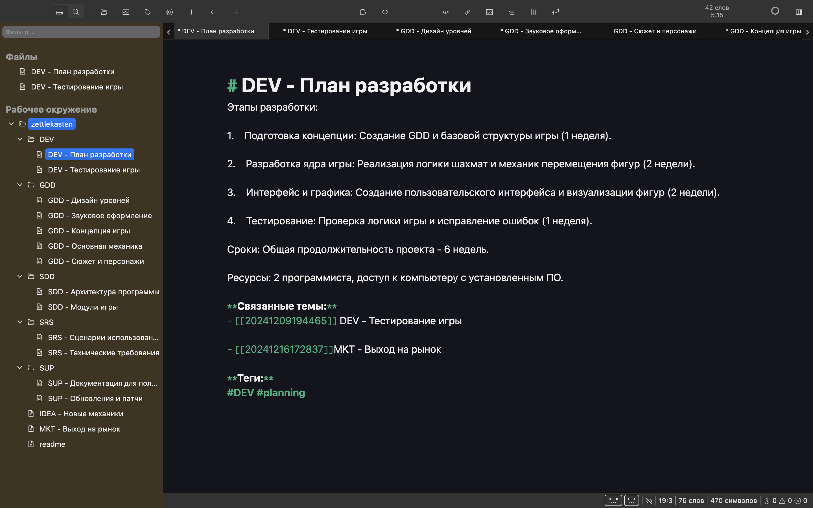
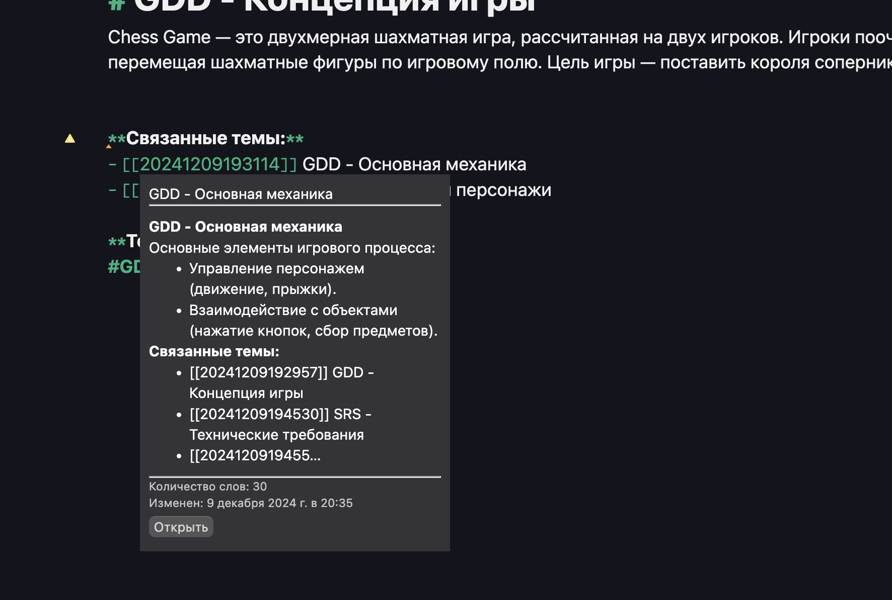

# Практическая работа №2 - Zettelkasten
### выполнили Костылева Э.П., Васильева Е.Д.

Цель работы. Научиться организовывать и связывать информацию с использованием Zettlr в рамках методологии Zettelkasten, применяя это для разработки концепции, проектирования, и документирования компьютерной игры с использованием движка Pygame или иного по выбору
 
 